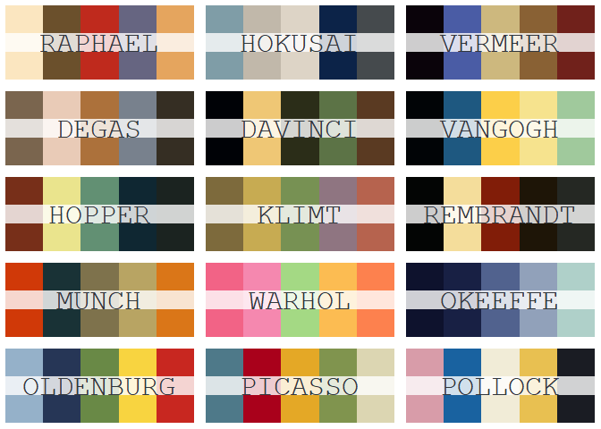
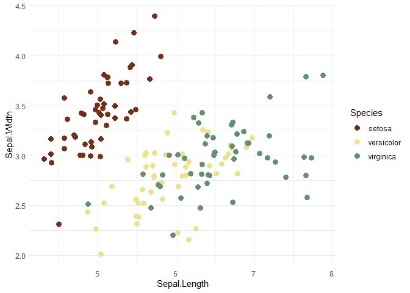

<!-- README.md is generated from README.Rmd. Please edit that file -->

# rtist

[](https://travis-ci.org/tomasokal/rtist)
[](https://CRAN.R-project.org/package=rtist)
[](https://cran.r-project.org/package=rtist)
[](http://www.r-pkg.org/pkg/rtist)

## Overview

“They’ll sell you thousands of greens. Veronese green and emerald green
and cadmium green and any sort of green you like; but that particular
green, never.” - *Pablo Picasso, (1966)*

Use the palettes of famous artists in your own visualizations.

## Installation

Install from CRAN or from Github.

``` r
# Using install.packages().
install.packages("rtist")

# Install remotes to download.
install.packages("remotes")

# And then install from github.
remotes::install_github("tomasokal/rtist")
```

## Palettes

`rtist` provides color palettes from famous artists and paintings. You
can quickly view and see all possible palettes using `rtist_help()`.

``` r
# Load package
library(rtist)

# Display possible palettes
rtist::rtist_help()
#>        rtist                      Painting            Artist
#> 1    raphael Saint Catherine of Alexandria           Raphael
#> 2    hokusai       Great Wave off Kanagawa           Hokusai
#> 3    vermeer     Girl with a Pearl Earring  Johannes Vermeer
#> 4      degas                      L Etoile       Edgar Degas
#> 5    davinci                     Mona Lisa Leonardo Da Vinci
#> 6    vangogh                  Starry Night  Vincent Van Gogh
#> 7     hopper                    Nighthawks     Edward Hopper
#> 8      klimt                      The Kiss      Gustav Klimt
#> 9  rembrandt                The Nightwatch         Rembrandt
#> 10     munch                    The Scream      Edward Munch
#> 11    warhol                  Flower, 1964       Andy Warhol
#> 12   okeeffe              Abstraction Blue  Georgia O'Keeffe
#> 13 oldenburg    Red Tights with Fragment 9   Claes Oldenburg
#> 14   picasso                     The Dream     Pablo Picasso
#> 15   pollock                      Number 1   Jackson Pollock
```

There are 15 palettes total.



After finding a palette, go ahead and select that palette along with
however many colors you want.

``` r
# Load package
library(rtist)

# Choose Warhol
rtist::rtist_palette("warhol")

# Choose 4 colors from Picasso
rtist::rtist_palette("picasso", 4)
```



## Credits

This package was mostly built to teach me package development. It was
largely inspired by [Ewen Henderson’s `ghibli`
package](https://github.com/ewenme/ghibli) and [Karthik Ram’s
`wesanderson` package](https://github.com/karthik/wesanderson).

The palettes themselves come from [10 Color Palettes Based on Famous
Paintings](http://www.skellermeyerdesigns.com/blog/10-color-palettes-based-on-famous-paintings)
and [Color Lisa](http://colorlisa.com/). Check those out for other
awesome palettes.
